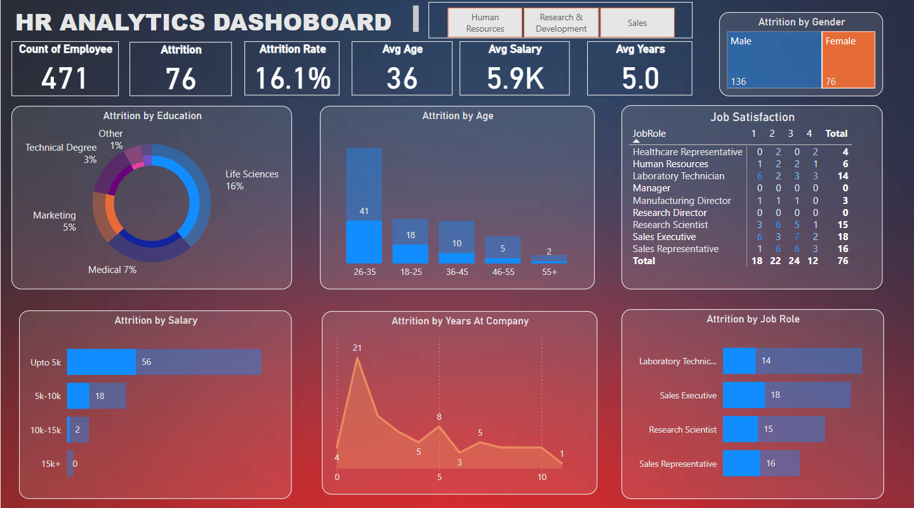

# 📊 HR Analytics Dashboard – by Mohammed Faiz

This is an interactive **HR Analytics Dashboard** built and published using **Microsoft Power BI Service**. It provides real-time insights into employee attrition, demographics, salary trends, and satisfaction levels using clean, professional visuals.

---

## 🔍 Key Insights

- 👥 **Attrition Trends** segmented by Age, Gender, Education, Salary, Job Role, and Years at Company
- 💰 **Average Metrics**: Salary, Age, Tenure
- 📊 **Job Satisfaction Levels** across the organization
- 📈 Interactive and filterable charts powered by Power BI
- 🧩 Data-driven layout with intuitive navigation

---

## 🛠️ Technologies Used

- Microsoft Power BI (Desktop & Cloud Service)
- CSV Data Files (Imported from HR data)
- DAX (Data Analysis Expressions) for calculated metrics
- Power BI Web Publishing for live sharing

---

## 🚀 Live Dashboard

> 🔗 [View Live HR Dashboard](https://app.powerbi.com/view?r=eyJrIjoiNWUyMTYwYjgtY2Y5Mi00YTA3LWEyZTktODhiM2RhYTAzMGZlIiwidCI6ImFiY2UxNzIxLWNkMmUtNDAzZS05Zjk0LTEzYjVjYzIzNjczYSJ9)  

---

## 📷 Screenshot

---

## 💼 About Me

**Mohammed Faiz**  
🔗 [Portfolio](https://mfaiz01.github.io/MyPortfolio/)  
🔗 [LinkedIn](https://www.linkedin.com/in/mohammed-faiz-pes/)

---

## 📝 How to Use

If you're reviewing this project:

1. Download the `.pbit` file 
2. Open with Power BI Desktop
3. Or use the **Live Link** above for instant access

You can also fork this repo to showcase your own data!

---

## 📜 License

This project is intended for educational and portfolio purposes.  
Feel free to use, adapt, or reference with credit. 🤝

---
